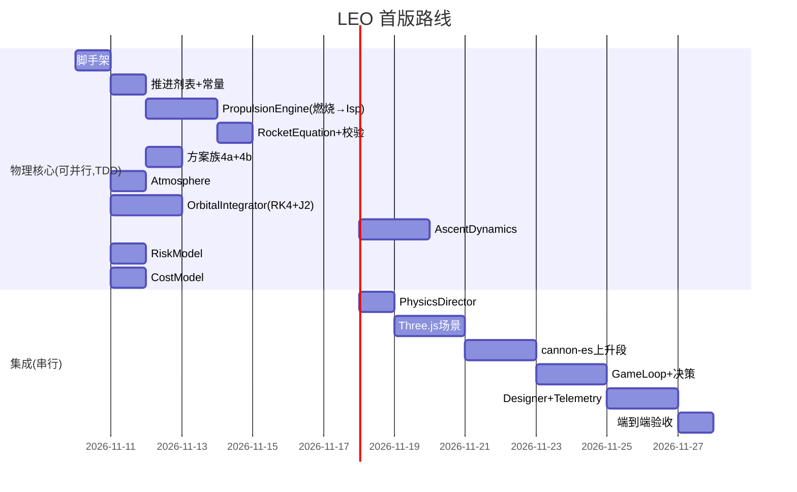

# Roadmap

## Milestones

LEO 首版载人航天推演模拟器。计划: docs/superpowers/plans/2026-11-10-crewed-spaceflight-leo.md。

```mermaid
gantt
  title LEO 首版路线
  dateFormat YYYY-MM-DD
  section 物理核心(可并行,TDD)
  脚手架 :t1, 2026-11-10, 1d
  推进剂表+常量 :t2, after t1, 1d
  PropulsionEngine(燃烧→Isp) :t3, after t2, 2d
  RocketEquation+校验 :t4, after t3, 1d
  方案族4a+4b :t5, after t2, 1d
  Atmosphere :t6, after t1, 1d
  OrbitalIntegrator(RK4+J2) :t7, after t1, 2d
  AscentDynamics :t8, after t4t6, 2d
  RiskModel :t9, after t1, 1d
  CostModel :t10, after t1, 1d
  section 集成(串行)
  PhysicsDirector :t11, after t8t9t10, 1d
  Three.js场景 :t12, after t11, 2d
  cannon-es上升段 :t13, after t12, 2d
  GameLoop+决策 :t14, after t13, 2d
  Designer+Telemetry :t15, after t14, 2d
  端到端验收 :t16, after t15, 1d
```
